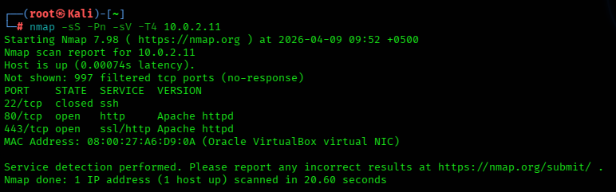
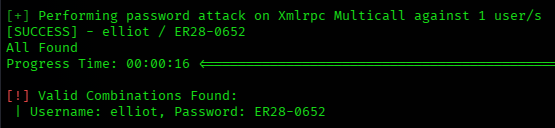
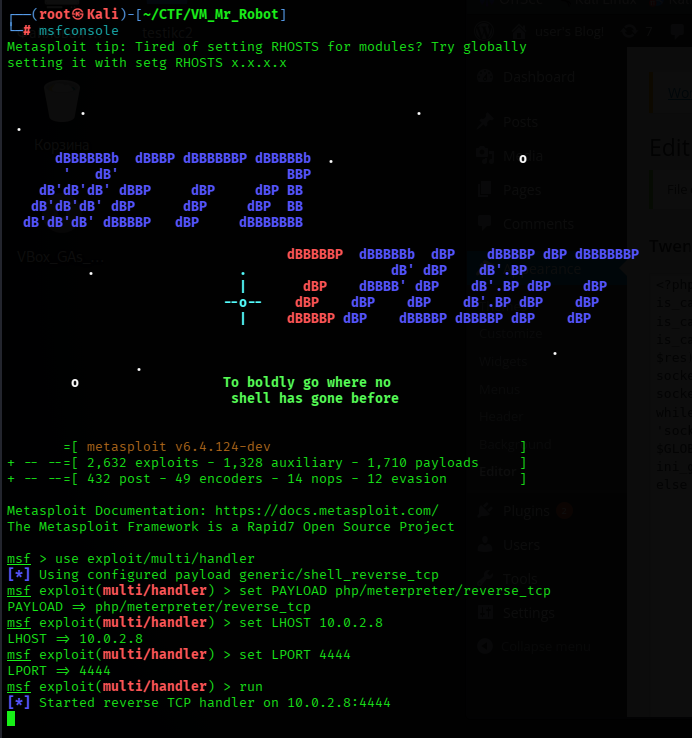
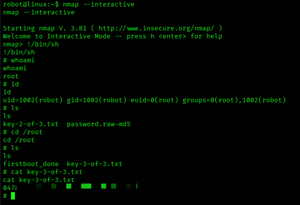

# 📑 Отчет по результатам анализа защищенности: Mr. Robot
**Статус:** 🔴 КРИТИЧЕСКИЙ УРОВЕНЬ РИСКА

---

## 1. Резюме для руководства
В ходе аудита системы `10.0.2.11` был получен полный контроль над сервером. Атака прошла путь от утечки конфиденциальных данных через веб-интерфейс до эксплуатации уязвимых SUID-файлов.

**Ключевые уязвимости:**
1.  **Information Disclosure:** Утечка словаря паролей и первого флага через `robots.txt`.
2.  **Weak Authentication:** Уязвимость к перебору паролей (Brute-force) в CMS WordPress.
3.  **Privilege Escalation:** Небезопасная конфигурация SUID-битов (бинарный файл `nmap`).

---

## 2. Сводка найденных уязвимостей

| ID | Уязвимость | Вектор | Критичность |
| :--- | :--- | :--- | :--- |
| **VULN-01** | Раскрытие чувствительных данных (`robots.txt`) | Удаленный | **MEDIUM** |
| **VULN-02** | Отсутствие защиты от перебора (Brute-force) | Удаленный | **HIGH** |
| **VULN-03** | Небезопасные права доступа (SUID nmap) | Локальный | **CRITICAL** |

---

## 3. Технический анализ и ход атаки

### 3.1. Разведка и сбор данных
С помощью `netdiscover` и `nmap` был обнаружен узел `10.0.2.11` с активными портами 80 (HTTP) и 443 (HTTPS). Использование `gobuster` выявило структуру сайта и наличие CMS WordPress.

### 3.2. Получение доступа
В файле `robots.txt` были найдены ссылки на словарь `fsocity.dic` и первый флаг.
1. **Словарь:** Файл был загружен и очищен от дубликатов (`sort -u`).
2. **Brute-force:** С помощью `wpscan` был подобран пароль пользователя `elliot`.
3. **Reverse Shell:** Через редактор тем WordPress был внедрен PHP-шелл (Meterpreter).

### 3.3. Повышение привилегий
В домашней директории пользователя `robot` был найден MD5-хеш пароля. После его расшифровки был получен доступ к учетной записи `robot`.

**Путь к Root:**
Был обнаружен файл `nmap` с установленным SUID-битом. Это позволило использовать интерактивный режим для исполнения системных команд от имени суперпользователя.

`nmap --interactive`

`!/bin/sh`

*Результат: Полная компрометация системы.*

---

## 🛡️ 4. План мероприятий по устранению

### 4.1. Первоочередные меры
1. **Исправление прав доступа (SUID):** Бинарный файл `nmap` имеет установленный флаг SUID, что позволяет любому пользователю получить права ROOT через интерактивный режим. 
   * **Действие:** Удалите SUID-бит: `chmod u-s /usr/local/bin/nmap` (или путь, где лежит nmap).

### 4.2. Защита веб-приложения
1. **Блокировка перебора паролей (Brute-force):** Система позволила провести атаку по словарю (через `wpscan`/`hydra`).
   * **Действие:** Установите плагин (например, *Limit Login Attempts Reloaded*) или настройте блокировку IP на уровне веб-сервера после 3-5 неудачных попыток входа.
2. **Двухфакторная аутентификация (2FA):** Включите 2FA для администраторов (Elliot), чтобы подбор пароля не давал доступа к панели управления.

### 4.3. Системная безопасность
1. **Хранение паролей:** Обнаружение файла `password.raw-md5` в домашней директории говорит о небезопасном хранении учетных данных.
   * **Рекомендация:** Используйте менеджеры паролей и современные методы хеширования (Argon2, bcrypt) вместо устаревшего MD5.
2. **Принцип минимальных привилегий:** Пользователь, под которым работает веб-сервер, не должен иметь доступа к файлам в домашних директориях других пользователей (например, к данным пользователя `robot`).

## 🎯 [Пошаговый пентест](./writeup.md)