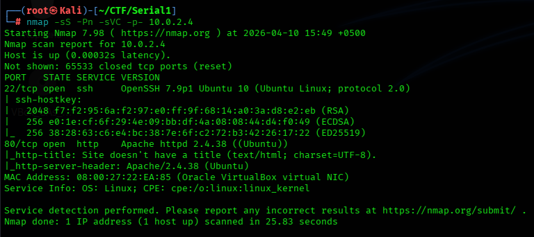
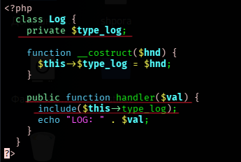
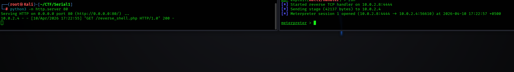
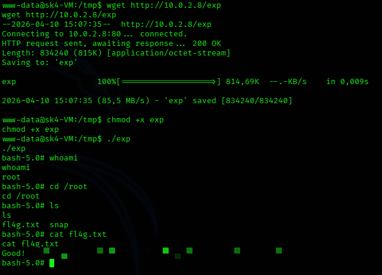

# 📑 Отчет по результатам анализа защищенности: Serial_1
**Статус:** 🔴 КРИТИЧЕСКИЙ УРОВЕНЬ РИСКА

---

## 1. Резюме для руководства
Целью аудита был узел `10.0.2.4`. В ходе тестирования обнаружена критическая уязвимость в логике обработки сессий веб-приложения. Злоумышленник может манипулировать сериализованными данными в Cookie для чтения произвольных файлов и удаленного выполнения кода (RCE).

**Основные находки:**
*   **Insecure Deserialization:** Возможность подмены PHP-объектов в Cookie.
*   **Information Disclosure:** Публичный доступ к архиву с исходным кодом (`bak.zip`).
*   **Kernel Exploit:** Уязвимость ядра (CVE-2021-3493) для локального повышения привилегий.

---

## 2. Сводка уязвимостей

| ID | Уязвимость | Вектор | Критичность |
| :--- | :--- | :--- | :--- |
| **VULN-01** | Небезопасная десериализация (PHP Object Injection) | Удаленный | **CRITICAL** |
| **VULN-02** | Раскрытие исходного кода (Backup exposure) | Удаленный | **HIGH** |
| **VULN-03** | Уязвимость ядра (CVE-2021-3493) | Локальный | **HIGH** |

---

## 3. Технический анализ и ход атаки

### 3.1. Разведка и анализ исходного кода
После сканирования портов был обнаружен веб-сервер и директория `/backup/`. Внутри находился архив `bak.zip`, содержащий исходный код. Анализ классов `User` и `Log` выявил возможность манипуляции свойством `$type_log`.

### 3.2. Эксплуатация (PHP Deserialization)
Был написан эксплойт-скрипт `exp.php` для генерации вредоносной Cookie. При десериализации объект `Log` переопределял путь к логам, позволяя читать системные файлы или записывать PHP-код.

**Вектор атаки:**
1. Генерация Cookie: `php exp.php`
2. Инъекция через `curl`:
`curl -v http://10.0.2.4/index.php --cookie "user=Tzo0..."`

*Результат: Получен Reverse Shell через Meterpreter.*

### 3.3. Повышение привилегий
С помощью скрипта `linpeas.sh` была обнаружена уязвимость ядра Ubuntu. Был использован эксплойт для **CVE-2021-3493** (OverlayFS).

1. Компиляция на Kali: `gcc exploit.c -o exp -static`
2. Запуск на целевой машине: `./exp`

*Результат: Полная компрометация системы.*

---

## 🛡️ 4. План мероприятий по устранению

### 4.1. Первоочередные меры
1. **Безопасность сессий (Deserialization Fix):** Приложение доверяет данным из Cookie без проверки их целостности. 
   * **Действие:** Замените передачу сериализованных объектов на использование безопасных форматов (например, JSON) или храните данные сессий на стороне сервера (server-side sessions). Если использование сериализации необходимо, внедрите подпись данных через **HMAC**, чтобы любые изменения Cookie делали её невалидной.
2. **Закрытие утечек (Data Disclosure):** Публичный доступ к `/backup/bak.zip` позволил провести анализ исходного кода.
   * **Действие:** Удалите все архивы, бэкапы и файлы `.git` из директорий, доступных веб-серверу. Настройте правила `.htaccess` или конфигурацию Nginx/Apache для запрета листинга директорий.

### 4.2. Системная защита
1. **Обновление ядра (LPE Patching):** Успешная эксплуатация **CVE-2021-3493 (OverlayFS)** стала возможной из-за отсутствия патчей безопасности.
   * **Действие:** Обновите ядро ОС до актуальной стабильной версии (`apt-get update && apt-get upgrade`).

### 4.3. Рекомендации по разработке
*   **Валидация входных данных:** Внедрите строгую типизацию для всех данных, поступающих от пользователя.
*   **Аудит кода:** Проведите аудит магических методов PHP (`__construct`, `__destruct`, `__wakeup`), которые могут быть использованы как "гаджеты" в цепочках десериализации.

## 🎯 [Пошаговый пентест](./writeup.md)