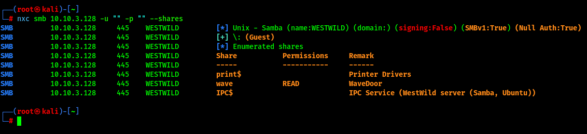
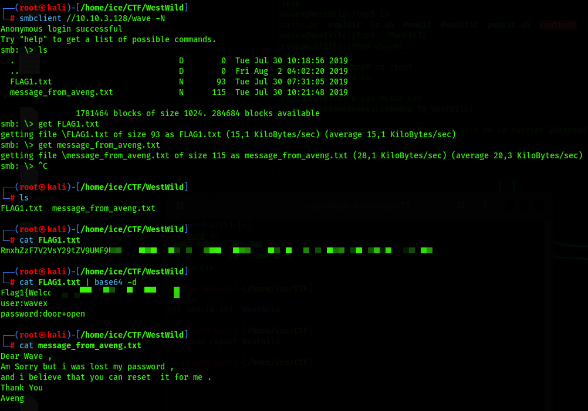
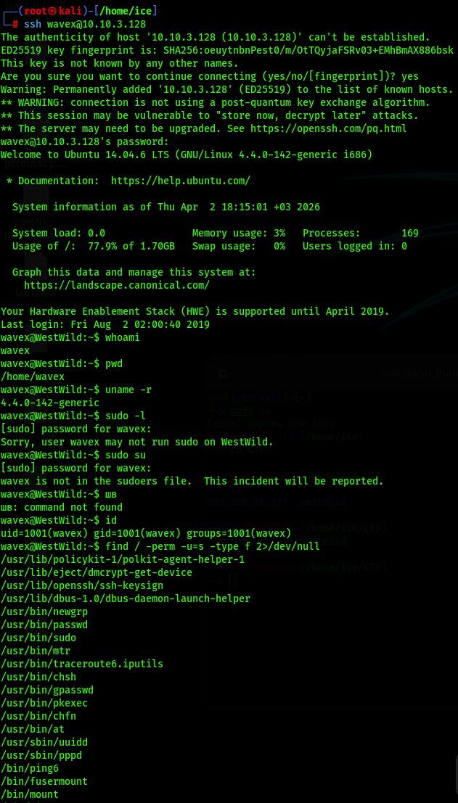
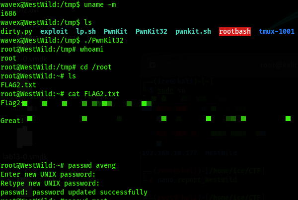

# 📑 Отчет по результатам анализа защищенности: WestWild
**Статус:** 🔴 КРИТИЧЕСКИЙ УРОВЕНЬ РИСКА

---

## 1. Резюме для руководства

Целью аудита был узел под управлением Linux (WestWild). В ходе тестирования была выявлена цепочка уязвимостей, начавшаяся с небезопасной конфигурации сетевых ресурсов и закончившаяся полной компрометацией ядра системы. Злоумышленник, не имея исходных учетных данных, может извлечь пароль из общедоступной папки и повысить привилегии до уровня суперпользователя (root) через критическую уязвимость в системном компоненте Polkit.

**Основные находки:**
*   **Information Disclosure:** Хранение учетных данных в открытом виде (Base64) на общедоступной SMB-шаре.
*   **Broken Access Control:** Анонимный доступ к сетевым ресурсам без аутентификации.
*   **Local Privilege Escalation (PwnKit):** Наличие в системе уязвимого компонента pkexec (CVE-2021-4034), позволяющего мгновенный захват контроля над узлом.

---

## 2. Сводка уязвимостей

| ID | Уязвимость | Вектор | Критичность |
| :--- | :--- | :--- | :--- |
| **VULN-01** | Анонимный доступ к файлам | Удаленный | **High** |
| **VULN-02** |	Пароли в открытом виде (или base64) | Удаленный | **High** |
| **VULN-03** | CVE-2021-4034 (PwnKit) | Внутренний | **Critical** |

---

## 3. Технический анализ и ход атаки

### 3.1. Внешняя разведка

Первичный анализ выявил открытые порты 22 (SSH) и 445 (SMB). Перечисление сетевых ресурсов через анонимную сессию (Null Session) позволило обнаружить общую папку `wave`.

### 3.2. Первоначальный доступ

В ходе анализа содержимого сетевой шары были обнаружены файлы FLAG1.txt и message_from_aveng.txt. В текстовом сообщении содержался пароль пользователя **wavex**, что позволило установить удаленную SSH-сессию.

**Вектор атаки:**
*   **Подключение к SMB:** `smbclient //10.10.3.128/wave -N`
*   **Извлечение данных:** `get FLAG1.txt`
*   **Удаленное подключение:** `ssh wavex@10.10.3.128`

*Результат: Получен доступ к системе с правами пользователя wavex.*

### 3.3. Анализ векторов повышения привилегий

Проверка окружения `uname -r`, `sudo -l` и поиск файлов с установленным SUID-битом показали, что система не обновлялась долгое время. Был подтвержден вектор эксплуатации уязвимости в системном компоненте **Polkit** (pkexec).

1. **Поиск SUID:** `find / -perm -u=s -type f 2>/dev/null`
2. **Эксплойт:** PwnKit (CVE-2021-4034).

### 3.4. Локальное повышение привилегий (LPE)

Из-за отсутствия возможности сборки на целевой машине, скомпилированный эксплойт **PwnKit32** был перенесен через `scp`. Запуск бинарного файла привел к переполнению в аргументах `pkexec` и предоставлению интерактивной оболочки с правами **root**.

1. **Перенос эксплойта:** `scp PwnKit32 wavex@10.10.3.128:/tmp/`
2. **Активация и запуск:** `chmod +x /tmp/PwnKit32 && /tmp/PwnKit32`

*Результат: Полная компрометация системы.*

### 3.5. Матрица MITRE ATT&CK

| Тактика | ID | Название техники | Описание действия |
| :--- | :--- | :--- | :--- |
| Reconnaissance | T1595 | Active Scanning | Сканирование портов с помощью nmap и поиск узлов через arp-scan |
| Initial Access | T1078 | Valid Accounts | Вход по SSH с использованием пароля, найденного в SMB-шаре |
| Discovery	Permission | T1069 | Groups Discovery | Проверка прав доступа командами id и sudo -l |
| Privilege Escalation | T1068 |Exploitation for Privilege Escalation | Использование эксплойта PwnKit для получения прав root |

---

## 🛡️ 4. План мероприятий по устранению

### 4.1. Первоочередные меры

1. **Защита сетевых ресурсов (SMB):** Отключите возможность анонимного доступа (Guest Access) и удалите файлы с паролями.

### 4.2. Системная защита

1. **Устранение уязвимости PwnKit:** Обновите пакет policykit-1 и ограничьте способы аутентификации.
    *   `apt-get update && apt-get install --only-upgrade policykit-1`
2. **Защита SSH:** Отключите вход по паролю для SSH и реализуйте его по ключам.
    *   `sed -i 's/PasswordAuthentication yes/PasswordAuthentication no/' /etc/ssh/sshd_config`

### 4.3. Рекомендации по мониторингу

1. **Контроль привилегированных операций:** Настройте аудит подозрительных процессов и отслеживайте использование SUID-битов.
    *   `auditctl -a always,exit -F path=/usr/bin/pkexec -F perm=x -k pkexec_usage`
2. **Поиск файлов с SUID-битом (еженедельная проверка):** `find / -perm -u=s -type f 2>/dev/null`

## 🎯 [Пошаговый пентест](./writeup.md)